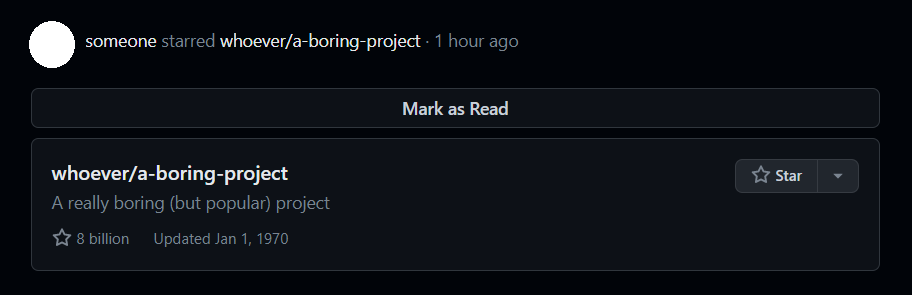

# GitHubSanitizer

**(Personal toy user script. Use with caution.)**

Mark as read repositories that you feel uninterested in or literally HAVE READ
thousands of times in your GitHub homepage news feed, and suppress them in the
future.

To save or load user data across browsers, follow [this post](https://stackoverflow.com/a/16829262/10586057).
